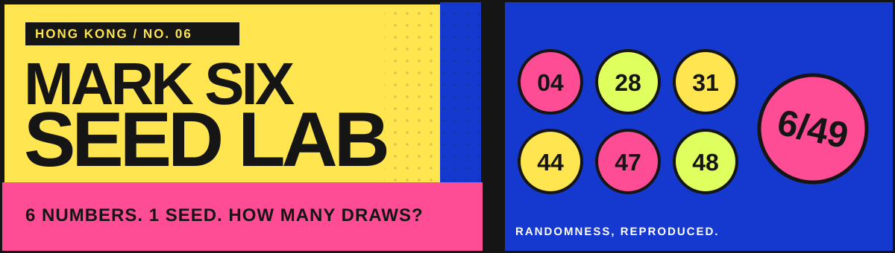

<p align="center">
  
</p>

<p align="center">
  <a href="https://hiyoman1167.github.io/mark6-fun/"><strong>🎟️ Open the live lab</strong></a>
  &nbsp;·&nbsp;
  <a href="https://github.com/hiyoman1167/mark6-fun/releases/latest">Latest release</a>
  &nbsp;·&nbsp;
  <a href="#run-it-locally">Run locally</a>
</p>

<p align="center">
  
  
  
</p>

<p align="center"><strong>六合彩號碼有幾難撞中？</strong><br>Pick six numbers. Give the simulator a seed. Watch how many draws it takes to meet your combination.</p>

## What is this?

**Mark Six Seed Lab** is a playful, reproducible randomness experiment inspired by Hong Kong's Mark Six. Enter six distinct numbers from 1–49, choose a seed, and search for the first time that combination appears in the app's simulated sequence. Then share the same seed and numbers with a friend so they can reproduce the experiment.

> [!IMPORTANT]
> This is an **unofficial simulation**, not a lottery predictor. Its seed controls only this app's pseudorandom sequence; it does not reveal a seed for real Mark Six draws. Buying Mark Six tickets is restricted to people aged **18 or over**.

## The fun bits

| | Explore |
|---|---|
| 🎯 **First encounter** | Search until your exact six-number combination first appears. The app checks earlier chunks before declaring a winner. |
| ⚡ **Four workers** | Split the search across up to four browser Web Workers, keeping the page responsive. |
| ⏭️ **Jump to draw N** | Enter a draw number and calculate that draw directly from the same seed. |
| 💸 **What would it cost?** | See a hypothetical spend at HK$10 per draw, alongside elapsed simulation time. |
| ✉️ **Pass the seed** | Copy a ready-to-post message with your numbers, seed, result, and a link that pre-fills the experiment. |
| 🎨 **Poster-style UI** | Bold colours, mobile-friendly controls, and a first-visit 18+ / unofficial notice saved in local storage. |

### Try the same experiment

Open [this seeded example](https://hiyoman1167.github.io/mark6-fun/?numbers=4%2C28%2C31%2C44%2C47%2C48&seed=mark6-2026-09-26), or enter:

```text
Numbers  4, 28, 31, 44, 47, 48
Seed     mark6-2026-09-26
```

Same seed + same draw index = same six numbers. The special number is outside this simulation.

## Run it locally

```bash
git clone https://github.com/hiyoman1167/mark6-fun.git
cd mark6-fun
npm run dev
```

Open **http://localhost:4173/**. There are no packages to install and no backend to start; the development command uses Python's built-in HTTP server, so Python 3 is required locally.

```bash
npm test
```

The tests cover number validation, reversible combination ranking, deterministic draw lookup, parallel first-hit ordering, and the theoretical single-draw chance.

## How it works

```text
six numbers + seed
        │
        ├─► seeded draw generator ─► jump straight to draw N
        │
        └─► Web Worker chunks ─────► verify earliest match
                                        │
                                        └─► draw count + next set + cost
```

The entire app runs in the browser: **HTML + CSS + vanilla JavaScript + Web Workers**. There are no accounts, API keys, database, server-side calculations, or analytics in this project. Share links carry only the numbers and seed in their URL. A seed's search space ends after **4,294,967,296 draws** because this version uses a 32-bit draw counter.

## Deploy

The website is published from the repository's `main` branch using **GitHub Pages**. Every push to `main` updates the static site. Once deployed, the share button automatically uses the public URL; a `localhost` link works only on your own computer.

To deploy your own fork: go to **Settings → Pages → Deploy from a branch**, then select **main** and **/(root)**.

## License

Released under the [MIT License](./LICENSE). Built for curiosity, not betting advice.
